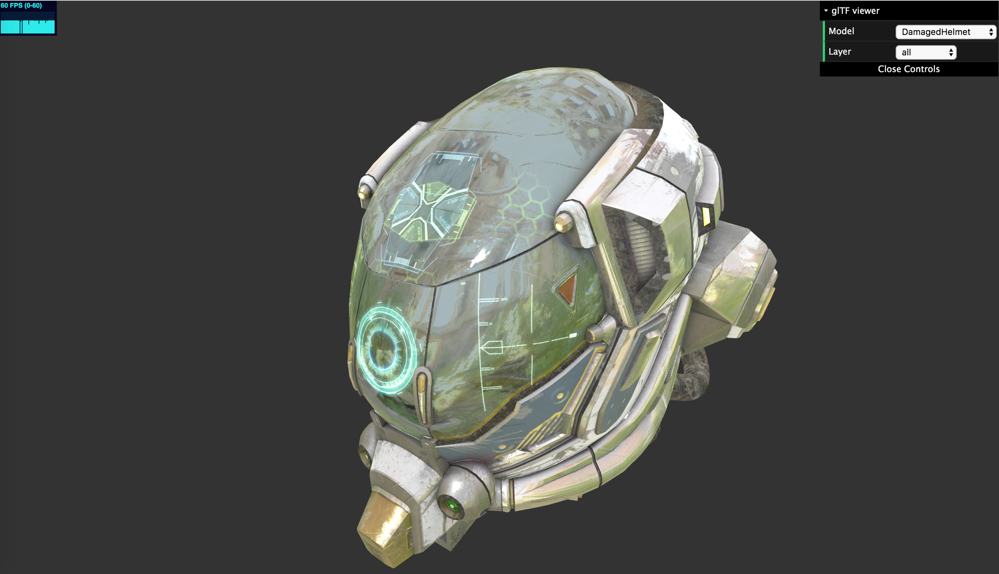

# a-simple-gltf-viewer

Just a simple glTF viewer inspired by: 
* [glTF-WebGL-PBR](https://github.com/KhronosGroup/glTF-WebGL-PBR/)
* [clay-viewer](https://pissang.github.io/clay-viewer/editor/)
* [MARMOSET VIEWER](https://marmoset.co/viewer/).

[](https://xiaoiver.github.io/a-simple-gltf-viewer/)

Features:
* PBR in glTF 2.0
* Use [Regl](https://github.com/regl-project/regl/) to handle WebGL stuffs.
* Use [InversifyJS](https://github.com/inversify/InversifyJS) as an IoC container.
* Use [gltf-loader-ts](https://github.com/bwasty/gltf-loader-ts/) to load glTF models.
* Soft Shadow（PCF）
* Skybox
* Timeline & [KeyFrame animation](https://github.com/KhronosGroup/glTF/tree/master/specification/2.0#animations).
* Also based on [electron-react-typescript-webpack-boilerplate](https://github.com/Devtography/electron-react-typescript-webpack-boilerplate).

TODO:
* Support [skin](https://github.com/KhronosGroup/glTF/tree/master/specification/2.0#skin).
* Support [Camera](https://github.com/KhronosGroup/glTF/tree/master/specification/2.0#cameras).
* Support [Morph](https://github.com/KhronosGroup/glTF/tree/master/specification/2.0#morph-targets)
* Use some PWA features to cache glTF model.
* Add more post-processing such as FXAA.
* Support drag & drop when uploading glTF model.
* Handle [context loss](https://github.com/regl-project/regl/blob/gh-pages/API.md#context-loss).

## Getting started

Then install all the `node_modules` needed by executing the following command:
```bash
npm run install
```

Finally execute the following command to start Webpack in development mode and 
watch the changes on source files.
```bash
npm run dev
```
